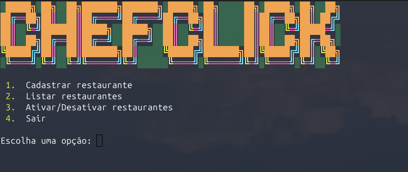
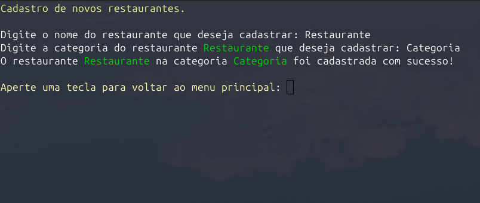
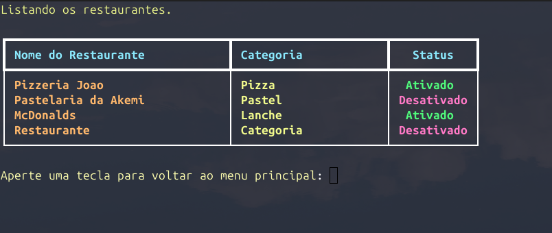

<p align="center">
  
  
  
</p>

<h1 align="center">🍽️ ChefClick</h1>
<p align="center">Um sistema de cadastro de restaurantes simples e eficiente, desenvolvido em Python.</p>

---

## 📖 Sobre o Projeto

**ChefClick** é um programa para gerenciamento de restaurantes, criado em Python como parte do curso *"Python: crie a sua primeira aplicação"* da Alura. Após o curso, o projeto foi aprimorado com novas funcionalidades, melhorias de código e maior robustez em relação à versão original.

### ✨ Funcionalidades
- 🖋️ **Cadastro**: Adicione novos restaurantes ao sistema.
- 📋 **Listagem**: Visualize todos os restaurantes cadastrados.
- ✏️ **Atualização**: Edite informações de restaurantes existentes.
- 🗑️ **Exclusão**: Remova restaurantes do sistema.
- 🔄 **Modo de Compatibilidade**: Opção para execução sem chamadas de comandos do sistema operacional.

---

## 🛠️ Tecnologias Utilizadas
- 🐍 **Python 3**

---

## 🚀 Como Executar o Projeto

### 📋 Requisitos
- Python 3.8 ou superior instalado.

### 📥 Passos para Instalação
1. Clone o repositório:
   ```bash
   git clone https://github.com/rouri404/Projeto-ChefClick.git
   ```
2. Navegue até o diretório do projeto:
   ```bash
   cd Projeto-ChefClick
   ```
3. Execute o script principal:
   ```bash
   python program.py
   ```

---

## 🖼️ Capturas de Tela

  



> **Nota**: Caso seja um contruidor, sinta-se a vontade de adicionar imagens do projeto em funcionamento, se desejar. Inclua as imagens em `screenshots`.

---

## 🤝 Como Contribuir
Contribuições são muito bem-vindas! Siga os passos abaixo para colaborar:
1. Faça um fork do projeto.
2. Crie uma branch para sua feature (`git checkout -b feature/nova-funcionalidade`).
3. Commit suas alterações (`git commit -m 'Adiciona nova funcionalidade'`).
4. Envie para o repositório remoto (`git push origin feature/nova-funcionalidade`).
5. Abra um Pull Request.

Se encontrar bugs ou tiver sugestões, abra uma **issue** no repositório.

---

## 🔧 Modo de Compatibilidade
O **Modo de Compatibilidade** é uma funcionalidade oculta que evita chamadas de comandos do sistema operacional para limpar a tela do terminal, garantindo maior portabilidade entre diferentes sistemas.

### Como Ativar
- No menu inicial, digite `0` (opção não listada).

### Diferenças
| **Modo**                | **Comportamento**                                                                 |
|-------------------------|-----------------------------------------------------------------------------------|
| **Padrão**              | Limpa a tela e exibe o novo texto no topo do terminal.                            |
| **Compatibilidade**     | Limpa a tela e exibe o novo texto no final da janela do terminal.                 |
